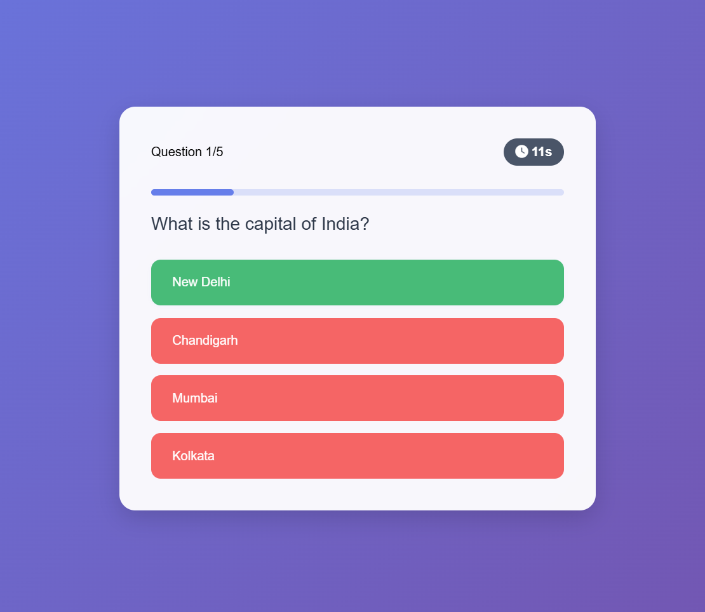

# Basic-Quiz-App-HTML-CSS-JS

A simple and interactive quiz application built using **HTML**, **CSS**, and **JavaScript**. This project demonstrates basic web development concepts such as DOM manipulation, event handling, timer functionality, and responsive UI design.

## 🚀 Features

- Multiple-choice quiz format
- Real-time answer validation
- Timer for each question or the full quiz
- Score tracking
- Responsive layout for desktop and mobile
- Simple, clean UI design

## 🖼️ Preview



## 🛠️ Tech Stack

- **HTML5** – Markup structure
- **CSS3** – Styling and layout
- **JavaScript (ES6)** – App logic and interactivity

## 📁 Project Structure

Basic-Quiz-App-HTML-CSS-JS/
├── index.html
├── style.css
├── script.js
└── README.md

## ⏱️ Timer Feature

The quiz includes a countdown timer that adds urgency and challenge to each session. You can customize the time limit per question or for the entire quiz depending on how the logic is structured in `script.js`.

## 🧠 How It Works

1. User starts the quiz and is presented with one question at a time.
2. A countdown timer starts when a question appears.
3. User selects an answer before time runs out.
4. Immediate feedback is provided, and the quiz progresses to the next question.
5. Final score is displayed at the end.

## 📦 Getting Started

1. Clone the repository:

```bash
git clone https://github.com/your-username/Basic-Quiz-App-HTML-CSS-JS.git
```

2. Open index.html in your browser.

No installation required—everything runs in the browser!

✨ Future Improvements

1. Store high scores using localStorage

2. Randomize question order

3. Add categories or difficulty levels

4. Enable sound effects or animations
